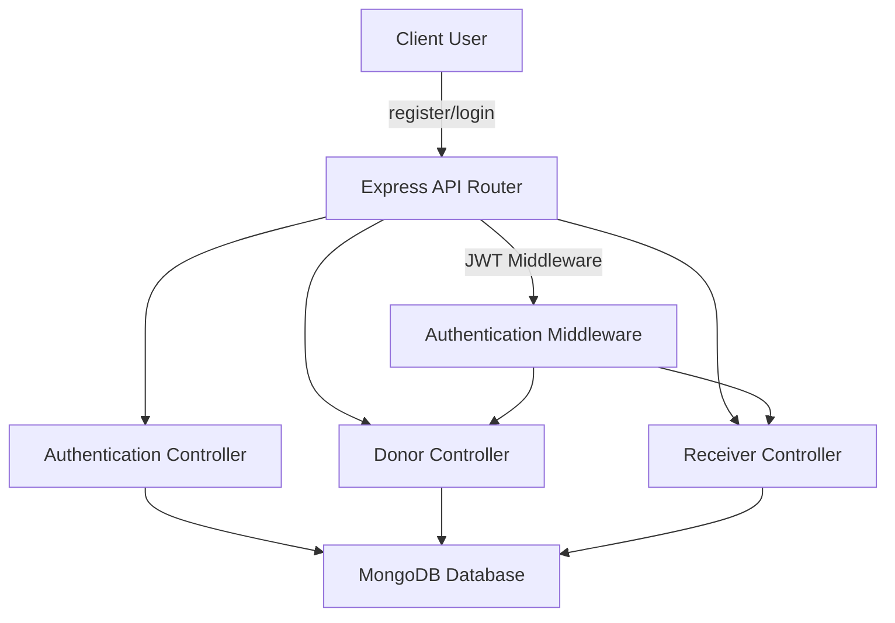

# PhalanaSathi

PhalanaSathi is a project that provides a streamlined backend for managing users, authentication, and interactions between different entities such as donors and receivers. It is designed to facilitate registration, login, and management of user-related data, focusing on efficiency and simplicity.

---

## Features

- User registration and login functionality
- Donor and receiver information capture and management
- Secure authentication using JWT
- Middleware for route protection
- Structured API endpoints for user and donation management
- MongoDB integration for persistent storage
- Error handling and response standardization

---

## Requirements

- Node.js (version 18 or higher)
- npm (Node Package Manager)
- MongoDB database instance
- Environment variables configured for database connections and JWT secrets

---

## Introduction

PhalanaSathi is built as a backend service, leveraging Node.js, Express, and MongoDB. It supports basic CRUD operations for users, donors, and receivers, and implements authentication flows using JWT. The architecture separates controllers, routes, and middleware for maintainability and clarity.

---

## Installation

1. Clone the repository:
   ```bash
   git clone https://github.com/adeshsinghbits/PhalanaSathi.git
   cd PhalanaSathi
   ```

2. Install dependencies:
   ```bash
   npm install
   ```

3. Set up the required environment variables in a `.env` file:
   ```
   MONGO_URI=your_mongodb_uri
   JWT_SECRET=your_jwt_secret
   PORT=3000
   ```

4. Start the server:
   ```bash
   npm start
   ```

---

## Usage

After installation and setup, the application exposes several API endpoints for user, donor, and receiver management.

### API Endpoints

#### User Registration

##### Register a new user

```api
{
    "title": "User Registration",
    "description": "Create a new user account with email and password.",
    "method": "POST",
    "baseUrl": "http://localhost:3000",
    "endpoint": "/api/register",
    "headers": [],
    "queryParams": [],
    "pathParams": [],
    "bodyType": "json",
    "requestBody": "{\n  \"email\": \"user@example.com\",\n  \"password\": \"yourpassword\"\n}",
    "responses": {
        "201": {
            "description": "User created successfully",
            "body": "{\n  \"message\": \"User registered successfully\"\n}"
        },
        "400": {
            "description": "Missing or invalid parameters",
            "body": "{\n  \"error\": \"All fields are required\"\n}"
        }
    }
}
```

#### User Login

##### Login an existing user

```api
{
    "title": "User Login",
    "description": "Authenticate a user and receive a JWT token.",
    "method": "POST",
    "baseUrl": "http://localhost:3000",
    "endpoint": "/api/login",
    "headers": [],
    "queryParams": [],
    "pathParams": [],
    "bodyType": "json",
    "requestBody": "{\n  \"email\": \"user@example.com\",\n  \"password\": \"yourpassword\"\n}",
    "responses": {
        "200": {
            "description": "Login successful",
            "body": "{\n  \"token\": \"jwt_token_here\"\n}"
        },
        "401": {
            "description": "Invalid credentials",
            "body": "{\n  \"error\": \"Invalid email or password\"\n}"
        }
    }
}
```

#### Add Donor

##### Register donor details

```api
{
    "title": "Add Donor",
    "description": "Submit donor information.",
    "method": "POST",
    "baseUrl": "http://localhost:3000",
    "endpoint": "/api/donor",
    "headers": [
        {
            "key": "Authorization",
            "value": "Bearer <token>",
            "required": true
        }
    ],
    "queryParams": [],
    "pathParams": [],
    "bodyType": "json",
    "requestBody": "{\n  \"name\": \"Donor Name\",\n  \"contact\": \"1234567890\"\n}",
    "responses": {
        "201": {
            "description": "Donor added",
            "body": "{\n  \"message\": \"Donor added successfully\"\n}"
        },
        "400": {
            "description": "Invalid data",
            "body": "{\n  \"error\": \"All fields are required\"\n}"
        }
    }
}
```

#### Add Receiver

##### Register receiver details

```api
{
    "title": "Add Receiver",
    "description": "Submit receiver information.",
    "method": "POST",
    "baseUrl": "http://localhost:3000",
    "endpoint": "/api/receiver",
    "headers": [
        {
            "key": "Authorization",
            "value": "Bearer <token>",
            "required": true
        }
    ],
    "queryParams": [],
    "pathParams": [],
    "bodyType": "json",
    "requestBody": "{\n  \"name\": \"Receiver Name\",\n  \"contact\": \"9876543210\"\n}",
    "responses": {
        "201": {
            "description": "Receiver added",
            "body": "{\n  \"message\": \"Receiver added successfully\"\n}"
        },
        "400": {
            "description": "Invalid data",
            "body": "{\n  \"error\": \"All fields are required\"\n}"
        }
    }
}
```

#### Protected Endpoints

All donor and receiver endpoints require a valid JWT token in the `Authorization` header.

---

## Contributing

- Fork the repository and create your branch from `main`.
- Ensure any install or build dependencies are removed before the end of the layer when doing a build.
- Submit a pull request with a clear description of your changes.
- Code must follow the repository’s formatting and linting rules.

---

## License

This project is licensed under the MIT License. You are free to use, modify, and distribute this software as permitted by the license.

---

## Configuration

PhalanaSathi uses environment variables to manage sensitive data and configuration:

- `MONGO_URI`: MongoDB connection string
- `JWT_SECRET`: Secret key for signing JWT tokens
- `PORT`: Port number for running the Express server

Set these variables in a `.env` file in the project root.

---

## Architecture Overview

Below is an overview of the core server structure and request flow:



---

PhalanaSathi delivers a focused backend solution for managing donation-related user flows, with secure authentication and clear extensibility for further features.
